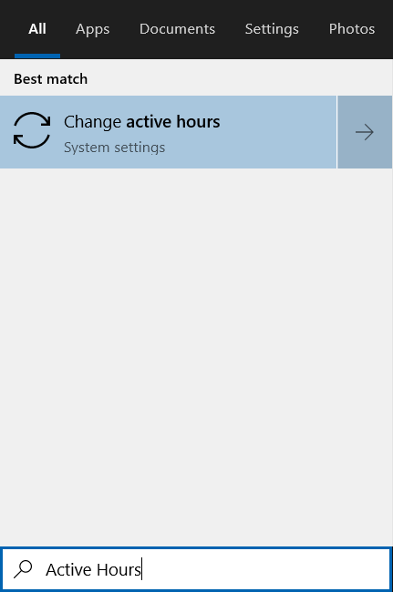
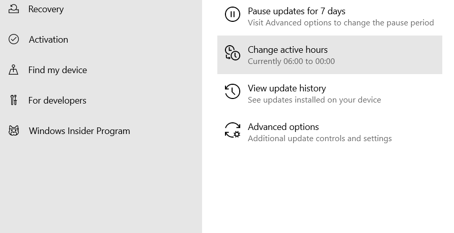
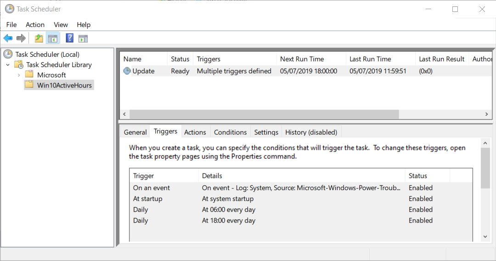

# Controlling when Windows will reboot after Windows Updates apply

You can control the time which you allow Windows to automatically reboot per Windows Update operations without disabling anything or forcefully stopping the Windows Update service. 

This script will not prevent any Windows Updates from being downloaded or installed ever so OS security patches will still be applied to the system ― you just have it reboot when you're ready. 

# How to use

1. Download the [setup.ps1](https://raw.githubusercontent.com/marcosbozzani/Win10ActiveHours/master/setup.ps1) script

2. Open PowerShell as Admin

3. Navigate to the downloaded script directory

4. Run `Set-ExecutionPolicy RemoteSigned -Scope CurrentUser`

5. Commands:
    - `.\setup.ps1`: install the scheduled task
    - `.\setup.ps1 -run`: manually executes the scheduled task
    - `.\setup.ps1 -uninstall`: uninstall the scheduled task

# How to verify the current `Active Hours`

1. Press <kbd>Win</kbd> or click on the `Start Menu`

2. Type `Active Hours` and click `Change active hours`

3. The current settings are displayed below `Change active hours` 

# How it works

This scripts is based in this answer from StackOverflow: https://superuser.com/a/1208866/351521

This script creates a scheduled task that dynamically sets the `Active hours` settings for `Start time` and `End time` based on the run time it's executed while ensuring to increment the values to always be hours ahead.

The task will be created at `\Win10ActiveHours\Update`

There are two `Active Hours` windows of 18 hours:
 - from `18:00` to `12:00`
 - from `06:00` to `00:00`

There are four triggers that will active the tasks and switch between the two windows:
 - at computer start up
 - at computer wake up
 - daily at `06:00`
 - daily at `18:00`

These are settings for the task:
 - wake to run
 - start when available
 - don't stop on idle end
 - allow start if on batteries
 - don't stop if going on batteries
